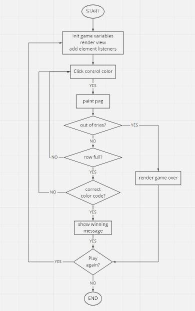
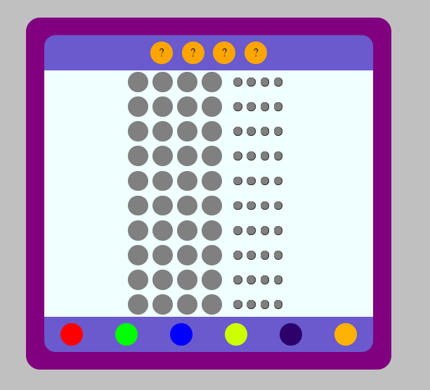
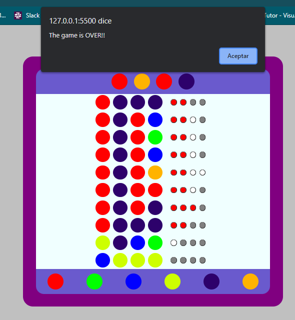
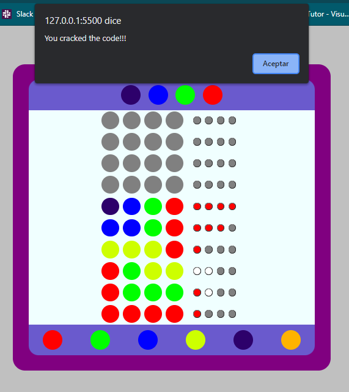
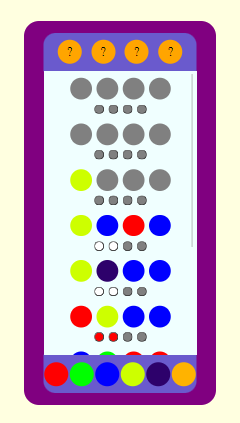

# Mastermind Game

<p align="justify"> This is a project at Holberton School where we implemented a version of the Mastermind game.
<br />
This is a board game, of ingenuity and reflection, at first this version only allows the interaction of one player, later in version 2 it will be multiplayer. </p>


## Proyect members

This project was productive every member of the team.

* **Renato Leon**
* **Manuel Condori**
* **Andres Condezo**
* **Alexis Coronado**


## Presentation of the language

<p align="justify"> <strong> JAVASCRIP </strong> was the chosen programming language.<br />
We chose this language because of the ease we have to give dynamism to a web page.
We can make interventions, animations and requests to the server without having to reload the page.

In addition, we can complement it with CSS, to obtain the graphic interface of the game.

Is one of the languages with the highest demand today </p>


## Instruccions

<p align="justify"> The color key is generated automatically. The player only has one turn.<br/>
The player has to try to guess with combinations of their preference, with the help of the grade-pegs it helps them to verify if the colors are suitable and are not in the correct place (whites) or that the colors are appropriate. and they're in the right place (reds). </p>

## Algorithm put in place

We have implemented a simple version of the game, with basic rules.


## User(s) flow to play

<div align="center">  </div>

## Piece of code related to the algorithm or flow

This function makes you paint with each color selected in the corresponding row.

```js
function paintPegs(el) {
    if (gameOver === true) {
        showGameOver()
        return;
    }

    const id=`guess-${currRow}-${currCol++}`
    let color = el.style.background
    let elem = document.getElementById(id)
    elem.style.background = color
    elem.dataset.color = el.dataset.color

    if (currCol == cols)
    {
        checkRowColors(currRow++)
        currCol = 0
    }

    if (currRow === rows)
    {
        renderAnswer()
        gameOver = true
    }
}
```


## Screenshots of the game

In this picture you can see the game



In this picture you can see that it ends correctly when it loses



In this picture you can see that it finishes correctly when it wins

<div align="center">  </div> 

We have implemented a responsive version of the page.

<div align="center">  </div> 


## Play Mastermind

We have created an environment to play Mastermind, in a docker container.

You can also play online with the following link:
[Play](https://alexiscoran.github.io/Mastermind_Challenge/Game_Files/index.html)

You can see the docker image in the following link: 
[Mastermind!](https://hub.docker.com/r/andrescondezo/mastermind_js)

You can run the image with the following suggested command

```Bash
docker run --name <name of the container> -p 8080:80 -d -ti andrescondezo/mastermind_js
```
